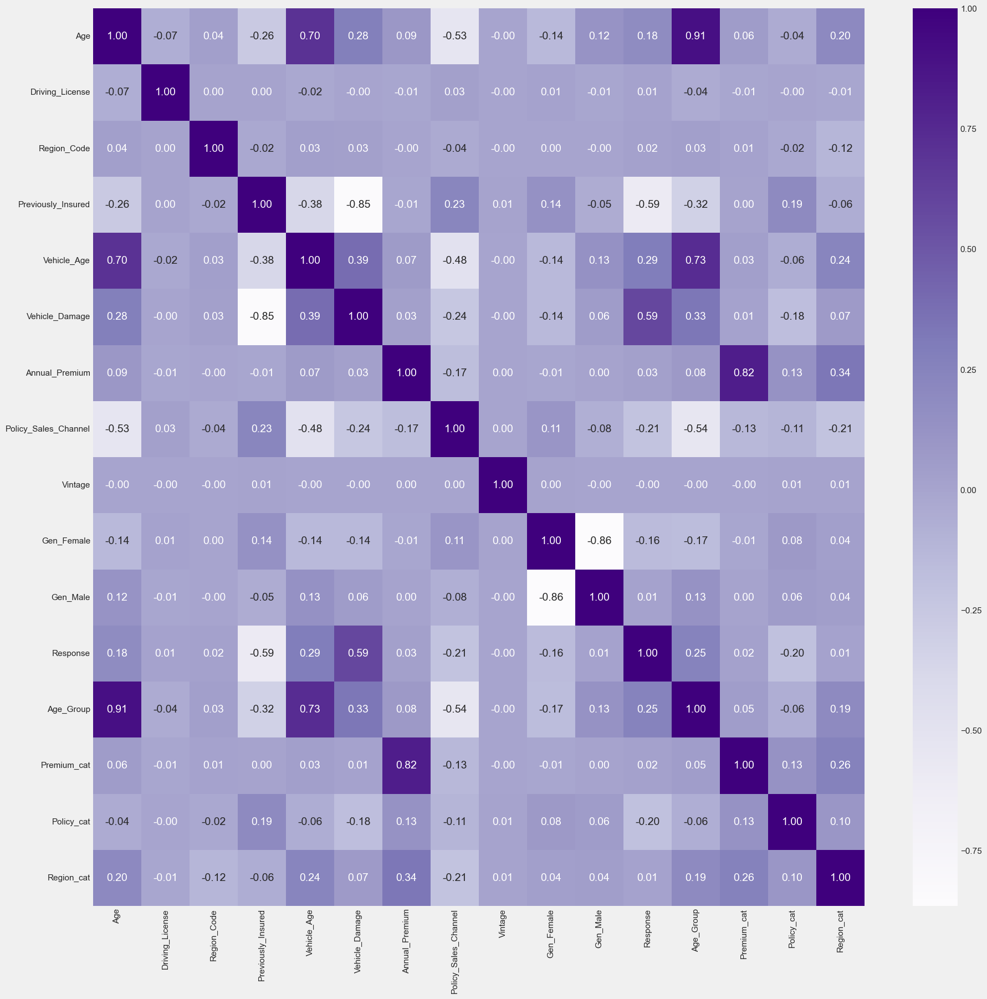

# Data Pre-processing, Feature Engineering, and Modelling
Tahapan selanjutnya setelah melakukan *Exploratory Data Analysis* di Stage 1 adalah melakukan *Data Pre-processing* dan *Feature Engineering*. Tahapan ini sangatlah penting dilakukan sebelum melakukan modeling pada *Machine Learning*. 

Setelah melakukan eksplorasi data pada tahap sebelumnya telah didapatkan beragam pengetahuan mengenai dataset yang sedang kita olah dan penanganan apa saja yang mungkin kita lakukan terhadap dataset tersebut agar dataset lebih siap digunakan dan juga meningkatkan performa model nantinya.

Pada tahap *pre-processing* dan *feature engineering* sendiri dilakukan untuk membersihkan data, pada dasarnya data-data sangat kotor ketika belum diolah yang berdampak pada ke-akurasian data sehingga tahapan ini dilakukan penanganan tersebut. Penanganan yang dimaksud dapat dilakukan dengan,
Mengubah tipe/format data

* Membersihkan/imputasi data-data yang kosong.
* Menghilangkan data duplikasi yang tidak diinginkan.
* Menseleksi data/fitur yang redundant.
* Mengubah skala/distribusi data untuk mempermudah *learning*.
* Menambahkan data sintetis/duplikasi.
* Menambah *features* baru ataupun mengambil inti dari *feature*.
* Mereduksi *features* ke dalam dimensi yang lebih rendah.

Pada dasarnya proses ini berlangsung secara iteratif,

Features Engineering -> Pre-Processing -> Machine Learning -> Model Evaluation

<--------------------------------------------------------------------

 

Modeling dalam *machine learning* merujuk pada proses pembangunan model statistik atau komputasi yang dapat digunakan untuk membuat prediksi atau mengambil keputusan berdasarkan data yang diberikan. Ini adalah salah satu langkah penting dalam proses *machine learning* dan *data science*.

Modelling ini merupakan *supervised learning classification* yang dimana hasilnya merupaka prediksi label 'Yes' / 'No' (1/0).

# Dataset Description
Sebelum melanjutkan ke inti pembahasan, berikut disertakan kembali deskripsi mengenai dataset,

|**Kolom**|**Deskripsi**|
|:-------:|:-----------:|
|id|ID unik untuk setiap customer.|
|Gender|Jenis kelamin dari customer.
|Age|Usia customer.
|Driving_License|0 : customer tidak memiliki izin mengemudi, 1 : customer memiliki izin mengemudi.
|Region_Code|Kode unik untuk tiap wilayah customer. 
|Previously_Insured | 0 : Customer belum memiliki 'Asuransi Kendaraan', 1 : Customer sudah memiliki 'Asuransi Kendaraan'.
|Vehicle_Age | Usia dari kendaraan milik customer.
|Vehicle_Damage | 0 : Kendaraan customer belum pernah rusak, 1: Kendaraan customer sudah pernah rusak.
|Annual_Premium | Premi tahunan yang harus dibayar oleh customer.
|Policy_Sales_Channel | Kode channel/media yang digunakan untuk menghubungi customer.
|Vintage | Jumlah hari customer sudah bergabung dengan perusahaan.
|Response|0 : Customer tidak tertarik 'Asuransi Kendaraan', 0 : Customer tertarik 'Asuransi Kendaraan'.

 

# Prerequisites

1. Dataset download [`here`](https://www.kaggle.com/datasets/anmolkumar/health-insurance-cross-sell-prediction?select=train.csv).
2. `pip install requirement.txt`.
3. Dataset Exploratory Data Analysis [`here`](https://github.com/gabmrn/Cross-Sell-Exploratory-Data-Analysis).

 

# Table of Contents

- Data Preprocessing - Missing Values
- Data Preprocessing - Duplicated Values
- Data Preprocessing - Outliers
- Data Preprocessing - Feature Encoding
- Data Preprocessing - Class Imbalance
- Feature Engineering - Feature Selection
- Feature Engineering - Feature Extraction
- Feature Engineering - Feature Recommendation
- Data Preprocessing - Feature Transformation
- Conclusion Preprocessing
- Modelling
- Evaluasi
- Conclusion Modelling

## Data Preprocessing - Missing Values

Melakukan pengecekan missing values dengan menggunakan `.isna()`/`.isnull()` . Serta melakukan pengecekan karakter tertentu yang mungkin termasuk NaN/NULL. 

Setelah dilakukan pengecekan terhadap NULL/NaN values, tidak terdapat NULL/NaN pada dataset.

## Data Preprocessing - Duplicated Values

Melakukan pengecekan duplicated values dengan menggunakan `.duplicated()` dan juga mengecek susbet kolom id.

Setelah dilakukan pengecekan terhadap duplicated values, tidak terdapat data duplikasi pada dataset.

## Data Preprocessing - Outliers

Dari insight yang didapat ketika EDA yang telah dilakukan di Stage 1, kita tahu `Annual Premium` memiliki outliers yang cukup extreme sehingga ditangani dengan penghapusan IQR ataupun capping.

Setelah melakukan handling outliers dengan metode IQR dan Capping dan didapatkan hasil,

    

Diputuskan untuk tetap menggunakan dataframe df karena, kolom `Annual_Premium` merupakan hal yang normal jika terdapat outliers sehingga tidak dilakukan penghapusan outliers. Hal ini juga didasarkan dengan pertimbangan pembuatan model yang robust terhadap outliers.

## Data Preprocessing - Feature Encoding

Mengubah `Vehicle_Damage` ke integer dalam = 0: Kendaraan customer belum pernah rusak, 1: Kendaraan customer sudah pernah rusak, serta `Vehicle_Age` dam 0: < 1 Year, 1: 1-2 Years, 2: > 2 Years. Serta `Gender` dengan *One Hot Encoding*. Melakukan konversi ke angka mulai dari 0 untuk memudahkan kerja machine learning. Mengubah kolom dengan datatype bool ke integer agar lebih mudah diproses oleh model.

## Data Preprocessing - Class Imbalance

Penanganan Class Imbalance dilakukan dengan ***oversampling*** dan ***undersampling*** dengan pertimbangan agar data tidak cenderung bias, dimana selisih antara kedua value 0 dan 1 lebih dari 50% sehingga jika dilakukan *oversampling* tidak menjamin akan adanya peningkatan performansi machine learning, namun dibutuhkan pula oversampling agar data tidak underfit.

## Feature Engineering - Feature Selection

Dilakukan penghapusan feature `id` yang tidak relevan terhadap model dengan `.drop()`. Lalu dilakukan pengecekan korelasi antar kolom dengan menggunakan heatmap.

    

Dari heatmap dapat didapatkan insight bahwa, `Age` dan `Vehicle_Age` merupakan kolom redundant sehingga diputuskan untuk tidak menggunakan pada kolom `Age` dengan pertimbangan kolom `Age` memiliki korelasi lebih kecil dibandingkan `Vehicle_Age`.

## Feature Engineering - Feature Extraction

*Feature Extraction* yang dibuat antara lain,
1. Age_Group, melakukan *dimension reduction* dengan mengelompokan feature `Age` menjadi 3 kategori utama dengan range YoungAdults 17 - 30 yang diwakili dengan 0, MiddleAged 31-45 diwakili dengan 1, OldAdults > 45 diwakili dengan 2.

2. Premium_cat, sama halnya dengan feature `Age_Group` feature ini adalah feature reduksi dari `Annual_Premium` dengan range LowPremium < 24406 diwakili dengan 0, MediumPremium 24406 - 61892.4 diwakili dengan 1 dan HighPremium > 61892.4 diwakili dengan 2.

3. Policy_cat, ekstraksi dari kolom Policy_Sales_Channel dengan menggunakan banyaknya customers dari tiap Channel yang kemudian diurutkan dari channel paling banyak dibagi menjadi 4 kategori.

4. Region_cat, sama halnya dengan Policy_cat feature ini merupakan ekstraksi dari kolom Region_Code dimana semakin banyak customers di Region tersebut maka akan masuk ke kategori yang lebih tinggi.

    

Dari hasil *feature extraction* didapatkan heatmap baru bahwa `Policy_cat` tidak memiliki korelasi dengan `Response`, sedangkan `Age_Group` dan `Premium_cat` memiliki korelasi *positive*.

## Feature Engineering - Feature Recommendation

1. `Premium_Per_Channel`, untuk menghitung dan memberi insight baru mengenai total premium dari berbagai `Policy_Sales_Channel` dengan begitu pengelompokkan Channel dapat dilakukan berdasarkan `Annual_Premium`.

2. `Vintage_Group`, feature baru yang mengubah feature `Vintage` menjadi kategori dengan range tertentu dimana diartikan menjadi New (baru bergabung), Intermediate (sudah bergabung cukup lama), Long-term (sudah bergabung lama).

3. `Not_Insured_and_Damaged`, kolom yang berisikan nilai 1 jika kolom `Previously_Insured` memiliki value 0 dan `Vehicle_Damage` memiliki value 1.

4. `Channel_Response_Rate`, merupakan rate respon dari tiap channel dimana menindikasikan seberapa efektif suatu channel untuk mendapatkan jawaban 'Yes' dari sini juga dapat dilakukan pengelompokkan Channels yang memiliki rate tinggi.

## Data Preprocessing - Feature Transformation

Melakukan transformasi terhadap kolom yang bukan merupakan kategori (numerik) namun merupakan kolom yang memang berupakan numerik (range). Sebelum dilakukan tranformasi dilakukan split test train dahulu untuk mencegah *Data Leakege*. Transformasi ini dilakukan dengan menggunakan metode boxcox.

Data Train

    

Data Test

    

Korelasi Heatmap

    

## Conclusion Pre-processing

Diputuskan menggunakan `StandardScaler`.

Features yang dipilih `Vehicle_Age`, `Vehicle_Damage`, `Previously_Insured`, `Gen_Female`, `Gen_Male`, `Age_Group`, `Region_cat`, `std_Annual_Premium`.

Sedangkan targetnya adalah `Response`.

## Modelling

Setelah dilakukan modelling pada *features* `Vehicle_Age`,`Vehicle_Damage`,`Previously_Insured`,`Gen_Female`,`Gen_Male`,`Age_Group`,`Region_cat`,`std_Annual_Premium` menggunakan algoritma `Logistic Regression`, `K-Nearest Neighbor`, `Decision Tree`, `XGBoost`, `Random Forest`, `LightGBM`, `Gradient Boost` didapatkan hasil bahwa model-model *overfitting*,

|Model|Accuracy Test|Accuracy Train|Precision Test|Precision Train|Recall Test|Recall Train|F1 Test|F1 Train|ROC AUC Test|ROC AUC Train|ROC AUC CrossVal Test|ROC AUC CrossVal Train|
|:-:|:-:|:-:|:-:|:-:|:-:|:-:|:-:|:-:|:-:|:-:|:-:|:-:|
|Logistic|0.79|0.78|0.71|0.71|0.98|0.98|0.82|0.82|0.82|0.82|0.99|0.80|
|KNN|0.76|0.81|0.72|0.77|0.82|0.88|0.77|0.82|0.81|0.89|0.99|0.80|
|Decision Tree|0.72|0.95|0.71|0.93|0.75|0.97|0.73|0.95|0.73|0.99|0.99|0.80|
|XGBoost|0.79|0.80|0.72|0.73|0.93|0.94|0.81|0.82|0.83|0.87|0.99|0.80|
|Random Forest|0.73|0.95|0.71|0.92|0.76|0.98|0.73|0.95|0.81|0.99|0.99|0.80|
|LightGBM|0.79|0.79|0.72|0.73|0.93|0.94|0.81|0.82|0.84|0.85|0.99|0.80|
|Gradient Boost|0.79|0.79|0.72|0.72|0.93|0.94|0.82|0.82|0.84|0.84|0.99|0.80|

Sehingga diputuskan untuk melakukan regularization dan hyperparameter tuning lain namun model masih overfitting maka dipertimbangkan untuk melakukan features selection ulang dan penambahan data (sudah dilakukan di preprocessing).

New Features Selection, `Vehicle_Age`,`Vehicle_Damage`,`Previously_Insured`,`Age_Group`,`Region_cat`,`Policy_Sales_Channel`,`Gen_Female`,`Gen_Male`.

## Evaluasi

**Hasil Score Modelling**
|Model|Accuracy Test|Accuracy Train|Precision Test|Precision Train|Recall Test|Recall Train|F1 Test|F1 Train|ROC AUC Test|ROC AUC Train|ROC AUC CrossVal Test|ROC AUC CrossVal Train|
|:-:|:-:|:-:|:-:|:-:|:-:|:-:|:-:|:-:|:-:|:-:|:-:|:-:|
|Logistic|0.79|0.79|0.72|0.72|0.93|0.94|0.82|0.82|0.87|0.87|0.93|0.92|
|KNN|0.79|0.80|0.78|0.78|0.83|0.83|0.80|0.80|0.89|0.89|0.93|0.92|
|Decision Tree|0.82|0.83|0.78|0.79|0.89|0.90|0.83|0.84|0.91|0.93|0.93|0.92|
|XGBoost|0.82|0.83|0.78|0.78|0.91|0.91|0.84|0.84|0.92|0.92|0.93|0.92|
|Random Forest|0.82|0.83|0.78|0.79|0.89|0.90|0.83|0.84|0.92|0.93|0.93|0.92|
|LightGBM|0.82|0.82|0.77|0.77|0.91|0.91|0.84|0.84|0.92|0.92|0.93|0.92|
|Gradient Boost|0.82|0.82|0.76|0.76|0.93|0.92|0.84|0.84|0.91|0.91|0.93|0.92|

**Hasil Score Hyperparameter Tuning**
|Model|Accuracy Test|Accuracy Train|Precision Test|Precision Train|Recall Test|Recall Train|F1 Test|F1 Train|ROC AUC Test|ROC AUC Train|ROC AUC CrossVal Test|ROC AUC CrossVal Train|
|:-:|:-:|:-:|:-:|:-:|:-:|:-:|:-:|:-:|:-:|:-:|:-:|:-:|
|Logistic|0.78|0.79|0.71|0.71|0.96|0.95|0.82|0.82|0.87|0.87|0.93|0.92|
|Decision Tree|0.79|0.79|0.73|0.72|0.94|0.94|0.82|0.82|0.86|0.86|0.93|0.92|
|XGBoost|0.82|0.82|0.76|0.76|0.94|0.94|0.84|0.84|0.92|0.92|0.93|0.92|
|Random Forest|0.81|0.81|0.74|0.74|0.95|0.95|0.83|0.83|0.89|0.89|0.93|0.92|
|LightGBM|0.82|0.82|0.77|0.77|0.92|0.92|0.84|0.84|0.92|0.92|0.93|0.92|
|Gradient Boost|0.82|0.82|0.76|0.76|0.93|0.93|0.84|0.83|0.91|0.91|0.93|0.92|

Dari karakteristik dataset yang sudah tidak memiliki *class imbalance* serta tujuan bisnis, evaluasi akan menitik beratkan pada score ***recall*** dimana meminimalisir False Negative serta ***ROC AUC*** score untuk menilai sejauh mana model mampu membedakan kelas (TPR dan FPR) walaupun *class* sudah seimbang.

Dari score diatas didapatkan model yang memiliki score yang baik untuk prediksi klasifikasi adalah model hasil algoritma `XGBoost`, `LightGBM`, `Random Forest` dan `Gradient Boost`.

## Conclusion Modelling
## The Best Fit Model

### **`XGBoost Model`**
Model ini memiliki score recall yang tinggi yakni mencapai **0.94** dengan probabilitas machine learning sebesar **0.92** dan AUC ROC mencapai **0.91** pada hasil test data. Sedangkan pada train data nya hanya memiliki selisih terbesar 0.02 dari test data, yakni model tidak overfit maupun underfit yang dapat disebut sebagai model ***best fit***.

Confusion Matrix

    

Features Importance

    

Pada model **`XGBoost`**, 2 *features* yang memiliki *importance* terbesar adalah `Previously_Insured` dan `Vehicle_Damage` sedangkan 2 *features* yang paling rendah adalah `Policy_Sales_Channel` dan `Vehicle_Age`.

Shap Values Summary

    

* `'Previously_Insured'`: Value yang bernilai tinggi memiliki kontribusi negatif dengan hasil prediksi sedangkan value yang nilainya rendah memiliki kontribusi positif terhadap hasil prediksi.
* `'Policy_Sales_Channel'`: Semakin tinggi value berdampak kontribusi negatif terhadap prediksi sedangkan semakin rendah value memiliki kontribusi positif terhadap hasil prediksi.
* `'Vehicle_Damage'`: Semakin value bernilai tinggi memiliki kontribusi positif terhadap prediksi dan semakin rendah nilai value memiliki kontibusi negatif terhadap prediksi.
* `'Region_cat'`: Value yang bernilai tengah ke tinggi memiliki kontribusi negatif terhadap prediksi dan sebaliknya value yang bernilai rendah memiliki kontribusi yang positif.
* `'Gen_Female'`: Value tinggi berkontribusi negatif dan value rendah berkontribusi positif.
* `'Gen_Male'`: Value tinggi berkontribusi negatif dan value rendah berkontribusi positif.
* `'Age_Group'`: Value yang bernilai rendah dan tinggi memiliki kontibusi yang negatif terhadap prediksi sedangkan value yang memiliki nilai ditengah-tengah memiliki kontribusi yang positif.
* `'Vehicle_Age'`: Semakin tinggi value semakin negatif kontribusinya, dan semakin rendah value semakin positif kontribusinya terhadap prediksi.
